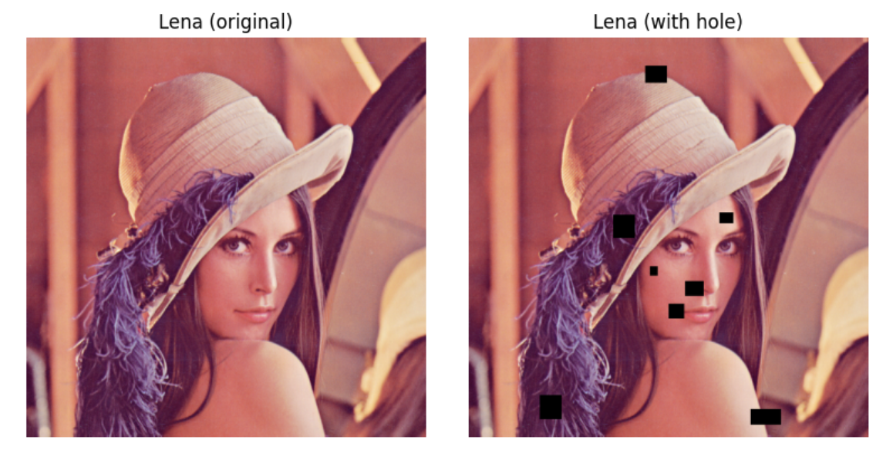

+++
title = "Image Inpainting with Convex Optimization with Heuristics"
date = "2025-07-17T22:33:15-04:00"

#
# description is optional
#
# description = "An optional description for SEO. If not provided, an automatically created summary will be used."

tags = []
+++

Image inpainting is the task of restoring missing or corrupted parts of an image.
State of the art methods are largely generative methods that are pretrained on
hundreds of thousands of images, and attempt to sample from the latent distribution
of the image. [[1]](#1) Rather than taking the "deep" approach, we will explore
methods that are entirely based on self-similarity measures.
The methods that we will explore are completely portable: they don't require any
priors, and no pretrained model is necessary.

We pose the image inpainting problem as an optimization problem.
To ensure that the problems are computationally tractable, we will aim for these
problems to be entirely convex.
Our exploration begins will begin with "classroom" examples of image inpainting with
convex optimization, and we develop several heuristics for our problem, until we
achieve visually satisfactory results.

We consider two kinds of image inpainting problems: random data loss, and rectangular
box inpainting.
Random data loss is representative of communication over a noisy channel, where we
lose pixels 50% of the time.
Rectangular box inpainting is a more explicit inpainting problem, where a user
would choose boxes that they would like the be filled in with something else.
This can be to erase unwanted features of an image.

We discover that within the image domain, first- and second-order differences are
usually sparse.
This is especially true for small holes (such as in data loss), or in large holes
with simple surroundings (such as a street with a shadow).

## Test Images
We consider the following test images that we will perform inpainting on:

<a href="#1">
Rombach, R., Blattmann, A., Lorenz, D., Esser, P., & Ommer, B. (2022). High-resolution image synthesis with
latent diffusion models. In Proceedings of the IEEE/CVF conference on computer vision and pattern recognition
(pp. 10684-10695).
</a>
