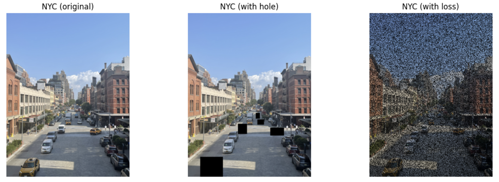
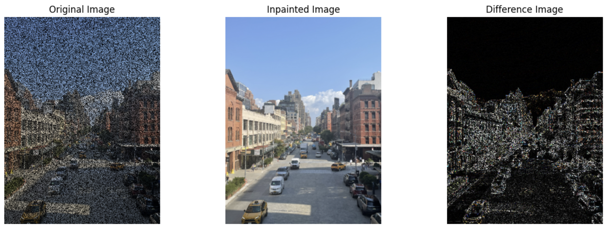
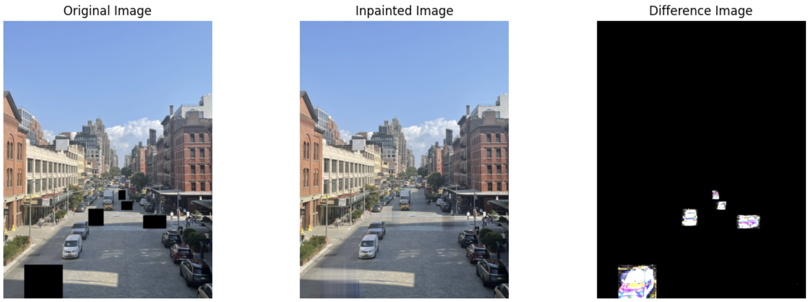
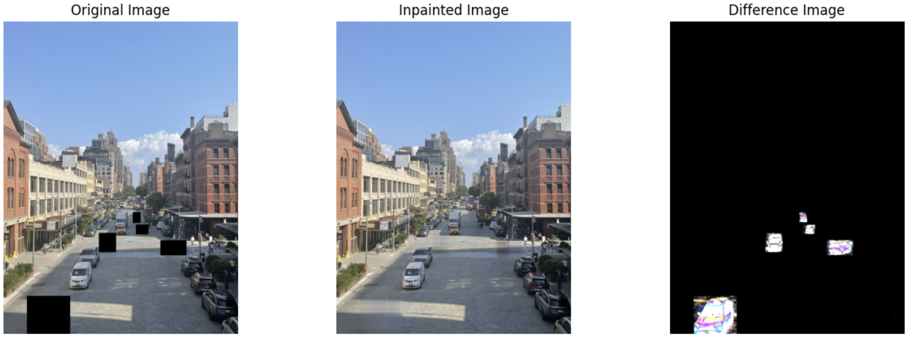
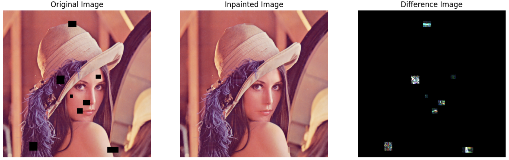

+++
title = "Image Inpainting with Convex Optimization with Heuristics"
date = "2025-07-17T22:33:15-04:00"

#
# description is optional
#
# description = "An optional description for SEO. If not provided, an automatically created summary will be used."

tags = []
+++

Image inpainting is the task of restoring missing or corrupted parts of an image.
State of the art methods are largely generative methods that are pretrained on
hundreds of thousands of images, and attempt to sample from the latent distribution
of the image. Rather than taking the "deep" approach, we will explore
methods that are entirely based on self-similarity measures.
The methods that we will explore are completely portable: they don't require any
priors, and no pretrained model is necessary.

We pose the image inpainting problem as an optimization problem.
To ensure that the problems are computationally tractable, we will aim for these
problems to be entirely convex.
Our exploration begins will begin with "classroom" examples of image inpainting with
convex optimization, and we develop several heuristics for our problem, until we
achieve visually satisfactory results.

We consider two kinds of image inpainting problems: random data loss, and rectangular
box inpainting.
Random data loss is representative of communication over a noisy channel, where we
lose pixels 50% of the time.
Rectangular box inpainting is a more explicit inpainting problem, where a user
would choose boxes that they would like the be filled in with something else.
This can be to erase unwanted features of an image.

We discover that within the image domain, first- and second-order differences are
usually sparse.
This is especially true for small holes (such as in data loss), or in large holes
with simple surroundings (such as a street with a shadow).

## Test Images
We consider the following test images that we will perform inpainting on:



## Section 1: Minimizing Total Variation
We begin by approaching the problem in the traditional, classroom way.
This is by minimizing what's called *total variation*.

Let \(U \in \mathbb{R}^{m \times n}\) be the matrix representing the reconstructed
image.
Then we define the total variation as
\[ \text{tv}(U) = \sum_{i=1}^{m-1} \sum_{j=1}^{n-1} \left\lVert \begin{matrix} U_{i+1,j} - U_{i,j} \\ U_{i,j+1} - U_{i,j} \end{matrix} \right\rVert. \]
The effect of this is to minimize any "large" deviation between known and unknown
pixels.
We can now solve this convex optimization problem.
Let \( K \) be the set of \( (i, j) \) indices that are known.
Call \( U^{\text{orig}} \) containing the known matrix values that do not need to
be filled in.
Then our optimization problem is
\[ \begin{align*} \text{min} & \quad  \text{tv}(U) \\ \text{s.t.} & \quad U_{ij} = U_{ij}^{\text{orig}} \quad \forall (i, j) \in K \end{align*} \]

We can write this using CVXPY as follows:
```python
def inpaint_tv_rgb(img):
    img_rgb = np.array(img).astype(np.float32) / 255.0
    H, W, C = img_rgb.shape
    mask = (np.sum(img_rgb, axis=2) > 0).astype(np.float32)

    # --- Variables ---
    U = [cp.Variable((H, W)) for _ in range(C)]

    # --- Objectives ---
    total_loss = 0
    constraints = []
    for c in range(C):
        total_loss += cp.tv(U[c])
        constraints += [
            cp.multiply(mask, U[c]) == cp.multiply(mask, img_rgb[:, :, c]),
            U[c] >= 0, U[c] <= 1
        ]

    # --- Solve ---
    prob = cp.Problem(cp.Minimize(total_loss), constraints)
    prob.solve(solver=cp.MOSEK, verbose=False)

    # --- Output ---
    u_val = np.stack([np.clip(U[c].value, 0, 1) for c in range(C)], axis=2)
    return u_val
```
The resulting image is


We see quite good performance on small holes in the Lena image.
Now we examine performance on the NYC image with loss, which has more structure.


Here, we see that total variation is very effective at dealing with images with
randomized loss, at the very least, in the visual sense.
It would be difficult for someone to tell that the inpainted image was ever
corrupted to begin with.

Now we examine how total variation inpainting deals with large corrupted blocks.


Note that here, we see quite poor performance with large shadow regions.
This is a clear consequence of us using a naive total variation approach.
Regions with shadows create large variations, but these are *expected* variations,
so in our next steps, we should figure out a way to punish bad variation, while
encouraging "expected" variation.

## Section 2: Approximating the Laplacian
We saw that, in our previous attempts, minimizing total variation is effective in
mitigating random noise, but large, structural changes pose significant challenges.
In order to try to fix this, we can add an additional term penalizing the
Laplacian.
Hopefully, this will be effective in capturing larger variations in the image.

We numerically approximate the Laplacian by calculating variations in the \(x\)
direction and in the \(y\) direction.

\[ \left\lVert \nabla \right\rVert^2 = \left\lVert \nabla_x \right\rVert^2 + \left\lVert \nabla_y \right\rVert^2, \]
where
\[ \nabla_x^2 = U_{i-1,j} - 2U_{i,j} + U_{i+1,j}, \]
and
\[ \nabla_y^2 = U_{i,j-1} - 2U_{i,j} + U_{i,j+1}. \]

We add a hyperparameter, \(\gamma\), which we will use to tune how much we want to
penalize the Laplacian.
In CVXPY, we can write this as

```python
def inpaint_tv_lap_rgb(img):
    img_rgb = np.array(img).astype(np.float32) / 255.0
    H, W, C = img_rgb.shape
    mask = (np.sum(img_rgb, axis=2) > 0).astype(np.float32)

    # --- Variables ---
    U = [cp.Variable((H, W)) for _ in range(C)]

    # --- Objectives ---
    total_loss = 0
    constraints = []

    for c in range(C):
        # --- Laplacian
        gamma = 0.01
        lap_x = U[c][:-2, 1:-1] - 2 * U[c][1:-1, 1:-1] + U[c][2:, 1:-1]
        lap_y = U[c][1:-1, :-2] - 2 * U[c][1:-1, 1:-1] + U[c][1:-1, 2:]
        lap = gamma * (cp.sum_squares(lap_x) + cp.sum_squares(lap_y))

        total_loss += cp.tv(U[c]) + lap
        constraints += [
            cp.multiply(mask, U[c]) == cp.multiply(mask, img_rgb[:, :, c]),
            U[c] >= 0, U[c] <= 1
        ]

    # --- Solve ---
    prob = cp.Problem(cp.Minimize(total_loss), constraints)
    prob.solve(solver=cp.MOSEK, verbose=False)

    # --- Output ---
    u_val = np.stack([np.clip(U[c].value, 0, 1) for c in range(C)], axis=2)
    return u_val
```
We now examine the two NYC images:


We see that, although the results didn't get worse, they didn't really get better,
either.

## Section 3: Total Generalized Variation
At this point, we try to introduce something called the Total Generalized Variation
(TGV).
This is an extension of TV, which attempts to balance first-order smoothness and
second-order smoothness using the \(l_1\) norm.

Total Variation will, as much as possible, try to create a piecewise constant block.
While this is effective for filling in small boxes in areas with little texture,
we see that this approach fails when texture information is present.
For example, with large shadows.
The Laplacian will then again smooth out flat regions.
This combination produces the smooth grey blocks that we see above.

Moreover, using the \(l_2\) norm for total variation and the Laplacian means that
the optimizer will "spread" errors out over all coordinates, which creates a
smoothing effect.

Total Generalized Variation, on the other hand, attempts to balance the first and
second-order effects while also promoting sparsity, by using the \(l_1\) norm.
The effect of using the \(l_1\) norm on first-order terms is that of allowing
large jumps in one direction, which means that edges will be preserved.
This is an assumption that the underlying structure is sparse.

If \(U\) is our image, then we'll let \(W\) approximate \(W \approx \nabla U\).
Then TGV can be written as
\[ \text{tgv}(U) = \alpha_1 \cdot \left\lVert \nabla U - W \right\rVert_1 + \alpha_2 \left\lVert \nabla W \right\rVert_1, \]
where \(\alpha_1\) and \(\alpha_2\) are tuning parameters.

Notice that minimizing the total generalized variation will promote small, sparse
gradients, as well as small second-order effects.
We implement the TGV based image-inpainting algorithm below.

```python
def inpaint_tgv_rgb(img):
    img_rgb = np.array(img).astype(np.float32) / 255.0
    H, W, C = img_rgb.shape
    mask = (np.sum(img_rgb, axis=2) > 0).astype(np.float32)

    # --- Parameters ---
    alpha1 = 2.5
    alpha2 = 6

    # --- Variables ---
    U = [cp.Variable((H, W)) for _ in range(C)]

    # --- Objectives ---
    total_loss = 0
    constraints = []

    for c in range(C):
        # --- First-order
        DUx = U[c][1:, :] - U[c][:-1, :]
        DUy = U[c][:, 1:] - U[c][:, :-1]
        Wx = cp.Variable((H - 1, W))
        Wy = cp.Variable((H, W - 1))

        # --- Second-order
        DWx = Wx[:, 1:] - Wx[:, :-1]
        DWy = Wy[1:, :] - Wy[:-1, :]
        tgv_first_order = cp.norm1(DUx - Wx) + cp.norm1(DUy - Wy)
        tgv_second_order = cp.norm1(DWx) + cp.norm1(DWy)
        tgv_total = alpha1 * tgv_first_order + alpha2 * tgv_second_order

        # --- Total
        total_loss += tgv_total

        # --- Constraints
        constraints += [
            cp.multiply(mask, U[c]) == cp.multiply(mask, img_rgb[:, :, c]),
            U[c] >= 0, U[c] <= 1
        ]

    # --- Solve ---
    prob = cp.Problem(cp.Minimize(total_loss), constraints)
    prob.solve(solver=cp.MOSEK, verbose=False)

    # --- Output ---
    u_val = np.stack([np.clip(U[c].value, 0, 1) for c in range(C)], axis=2)
    return u_val
```

This is considerable improvement!
We see that the shadows in the bottom left-hand corner is filled in, in such a way
that preserves the shape of the shadow.
That being said, we do see some vertical and horizontal artifacts.
This is a consequence of the fact that we use the \(l_1\) norm in the \(x\) and
\(y\) directions, which promotes sparsity precisely in these directions.
If we were using the \(l_2\) norm as before, we would like be able to eliminate some
of these artifacts

## Section 4: Resolving Artifacts in TGV inpainting
In order to eliminate the vertical and horizontal artifacts, we add a small \(l_2\)
total variation penalty.
This will penalize the vertical and horizontal lines that we see above.

```python
def inpaint_tgv_tv_rgb(img):
    img_rgb = np.array(img).astype(np.float32) / 255.0
    H, W, C = img_rgb.shape
    mask = (np.sum(img_rgb, axis=2) > 0).astype(np.float32)

    # --- Parameters ---
    alpha1 = 2.5
    alpha2 = 6
    beta = 0.01

    # --- Variables ---
    U = [cp.Variable((H, W)) for _ in range(C)]

    # --- Objectives ---
    total_loss = 0
    constraints = []

    for c in range(C):
        # --- (TGV) First-order
        DUx = U[c][1:, :] - U[c][:-1, :]
        DUy = U[c][:, 1:] - U[c][:, :-1]
        Wx = cp.Variable((H - 1, W))
        Wy = cp.Variable((H, W - 1))

        # --- (TGV) Second-order
        DWx = Wx[:, 1:] - Wx[:, :-1]
        DWy = Wy[1:, :] - Wy[:-1, :]
        tgv_first_order = cp.norm1(DUx - Wx) + cp.norm1(DUy - Wy)
        tgv_second_order = cp.norm1(DWx) + cp.norm1(DWy)
        tgv_total = alpha1 * tgv_first_order + alpha2 * tgv_second_order

        # --- Total Variation
        tv = beta * cp.tv(U[c])

        # --- Total
        total_loss += tgv_total + tv

        # --- Constraints
        constraints += [
            cp.multiply(mask, U[c]) == cp.multiply(mask, img_rgb[:, :, c]),
            U[c] >= 0, U[c] <= 1
        ]
    # --- Solve ---
    prob = cp.Problem(cp.Minimize(total_loss), constraints)
    prob.solve(solver=cp.MOSEK, verbose=False)

    # --- Output ---
    u_val = np.stack([np.clip(U[c].value, 0, 1) for c in range(C)], axis=2)
    return u_val
```

Observe that adding a small total variation penalty has smoothed out the vertical
and horizontal artifacts.
Our final optimizer is thus
\[ \begin{align*} \text{min} & \quad  \text{tgv}(U) + \beta \cdot \text{tv}(U) \\ \text{s.t.} & \quad U_{ij} = U_{ij}^{\text{orig}} \quad \forall (i, j) \in K \end{align*} \]
We can now test this inpainted on our remaining test images:



## Conclusion
We see that we're able to perform image inpainting tasks that effectively preserve
first-order effects (straight edges) and partially preserve second-order effects
(textures).
Moreover, we can accomplish this without any priors, using only local information
within the image.

Since we use only local information (first and second order differences), large
holes will pose significant challenges for us.
Even small holes, if they contain significant texture information, will not
adequately be filled.
At that point, it would be more effective to use inpainting methods that take into
account global information, like PatchMatch, or even generative methods, like
GANs or stable diffusion.

That being said, large blocks with little texture information, or very small blocks
where first and second order approximations are adequate will be filled in very
effectively, as we have seen with the NYC holes and loss examples.
